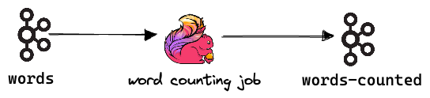

# Flink & Kafka End-to-End Test Example

## Purpose

This example demonstrates how to create and run an end-to-end integration 
test with Kafka and Flink using Kurtosis and the Kurtosis Starlark API, 
covering these common end-to-end testing related tasks:

* starting services and waiting for them to become ready for interaction
* testing and validating (asserting) code (features) by reading and processing json from a Kafka topic
* evaluating data from, and interacting with, APIs running inside an enclave
* package composition using a Starlark package inside another package
* using a docker helper image to execute a job

## Running the Example

To run the example, first ensure you have the latest Kurtosis CLI installed (by completing [the installation guide](https://docs.kurtosistech.com/quickstart#setup) and then running:

```shell
kurtosis run kurtosis-package/.
```

This command will create an enclave with a generated name and the services. Alternately, 
you can assign the enclave a specific name by running:

```shell
kurtosis run kurtosis-package/. --enclave flink-kafka
```

Note, if you already have an enclave running with the name `flink-kafka` you first need to remove it 
or provide the enclave with an ephemeral name by removing the `--enclave` switch.

```shell
kurtosis enclave rm -f flink-kafka
```

## Overview

The high level steps of the test are as follows:

* A Kafka and two node Flink cluster are created and the test waits for them to become ready for use 
* A demo Flink job is uploaded and executed on the Flink cluster 
(counts the number of times it sees a word on a topic and emits the count to another topic) 
* Data flows into a topic (`words`) that the Flink job reads from
* The Flink job processes the data and outputs the result on to another topic (`words-counted`).
* The Starlark script asserts if the output on the topic is as expected, thereby validating that the job works and 
integrates correctly with the infrastructure

This example demonstrates an end-to-end testing scenario that runs in an isolated testing environment that is completely ephemeral in nature, 
making it suitable to run in a build pipeline setting or for local regression and feature testing. 

### Test Design

The test ([Starlark script](kurtosis-package/main.star)) creates two topics in the Kafka cluster:

* `words`, where free text words are published
* `words-counted`, where a running count of the number of times a given word has been seen on the topic `words`

The Flink job reads from the `words` topic, 
keeps a running count of the number of times it has seen any given word and 
with every input, it outputs the running count to the `words-counted` topic.



In the test, we feed in the word `kurtosis` three times. 
The word counting job will emit three events with the following data on to the `words-counted` topic:

```json
{"word":"kurtosis","count":1}
{"word":"kurtosis","count":2}
{"word":"kurtosis","count":3}
```

In the Starlark script we check the `words-counted` topic eventually contains `{"word":"kurtosis","count":3}` 
using the built in ExecRecipe and the `jq` extractor support.